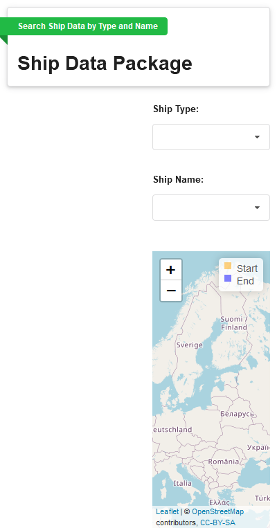

ShipsDataPackage
================
Edward Gillian
27/05/2021

-----

<!-- README.md is generated from README.Rmd. Please edit that file -->

<!-- badges: start -->

<!-- badges: end -->

The `shipsdatapackage` has a number of goals:

Firstly, this package uses `shiny.semantic` package from `Appsilon` to
provide the ui interface.

Secondly, this package uses reactivity to get ship type and ship name
input from the `ui` to display data about ship maximum distance and the
start and end of ship movements.

Lastly, automated testing is done through chained test functions using
`testthat`. These functions allow the developer to add different input
files to test the functions stored in the `R` folder to be tested for
reliable outputs. The functions use `expect_known_value` to generate the
test outputs.

## Installation

You can install the released version of `shipsdatapackage` with:

    devtools::install_github("EdwardJGillian/shipsdatapackage")

## Embedded Application

You can see the `shipsdatapackage` embedded in this document:

    #> Loading required package: shiny
    #> Warning: package 'shiny' was built under R version 4.0.5
    #> Warning: package 'shiny.semantic' was built under R version 4.0.5
    #> 
    #> Attaching package: 'shiny.semantic'
    #> The following objects are masked from 'package:shiny':
    #> 
    #>     actionButton, checkboxInput, dateInput, fileInput, flowLayout,
    #>     icon, incProgress, modalDialog, numericInput, Progress,
    #>     removeModal, removeNotification, selectInput, setProgress,
    #>     showNotification, sliderInput, splitLayout, textAreaInput,
    #>     textInput, updateActionButton, updateSelectInput,
    #>     updateSliderInput, verticalLayout, withProgress
    #> The following object is masked from 'package:graphics':
    #> 
    #>     grid
    #> The following object is masked from 'package:utils':
    #> 
    #>     menu
    #> Warning: package 'leaflet' was built under R version 4.0.5
    #> Warning: package 'geosphere' was built under R version 4.0.5
    #> 
    #> Attaching package: 'geosphere'
    #> The following object is masked from 'package:shiny':
    #> 
    #>     span
    #> Warning: package 'dplyr' was built under R version 4.0.5
    #> 
    #> Attaching package: 'dplyr'
    #> The following objects are masked from 'package:stats':
    #> 
    #>     filter, lag
    #> The following objects are masked from 'package:base':
    #> 
    #>     intersect, setdiff, setequal, union
    #> 
    #> Listening on http://127.0.0.1:3230



## Testing the package

As shown by the code below, a chained function using `purrr::map` is
created to loop through a file list of example data to test the core
functions to be tested for reliable outputs. This function creates a
series of reference files automatically

    library(shipsdatapackage)
    library(testthat)
    
    test_chained_functions <- function(csv_file) {
      test_that("check file values for parameters", {
        # naming helper
        tname <- function(n) {
          paste0(home,
                 "/data/known_value/",
                 csv,
                 ".",
                 n,
                 ".test"
          )
        }
    
        # create file path to csv file examples
    
        csv_path <-
          paste0(home, "/data/csv_examples/", csv_file)
        csv <- stringr::str_remove(csv_file, ".csv")
        df1 <- readr::read_csv(file=csv_path, col_names=TRUE, col_types = readr::cols())
        parameter_list <- shipsdatapackage::general_data_preprocess(df1)
    
        # SuppressWarnings used as expect_known_value is a deprecated function
        suppressWarnings(testthat::expect_known_value(
          parameter_list, tname("param_list")))
    
        frame_with_next_values <- cbind(df1[parameter_list$ranks,], next_lat = parameter_list$next_lat, next_lon = parameter_list$next_lon)
    
        frame_without_na <- frame_with_next_values[0:(nrow(frame_with_next_values)-1),]
    
        # rename columns by index to ensure column names are different
        frame_without_na <- frame_without_na %>%
          dplyr::rename(next_lat = 21, next_lon = 22)
    
        calc_distance <- mapply(shipsdatapackage::calculate_distance, frame_without_na$LON, frame_without_na$LAT, frame_without_na$next_lon, frame_without_na$next_lat)
    
        # SuppressWarnings used as expect_known_value is a deprecated function
        suppressWarnings(testthat::expect_known_value(
          calc_distance, tname("calc_dist")))
    
    
      })
    }
    
    # create the ALS file path
    home <- setwd(Sys.getenv("HOME"))
    
    csv_file_path <- file.path(home, "data/csv_examples")
    
    csv_files_list <- list.files(path = csv_file_path, pattern = "*.csv$", full.names = FALSE)
    
    # apply 1 list vector to the function
    purrr::map(csv_files_list, test_chained_functions)

### Testthat results:

``` r
library(testthat)
#> Warning: package 'testthat' was built under R version 4.0.5
#> 
#> Attaching package: 'testthat'
#> The following object is masked from 'package:dplyr':
#> 
#>     matches
library(dplyr)
library(magrittr)
#> Warning: package 'magrittr' was built under R version 4.0.3
#> 
#> Attaching package: 'magrittr'
#> The following objects are masked from 'package:testthat':
#> 
#>     equals, is_less_than, not
library(shipsdatapackage)
test_results_raw <- testthat::test_file("tests/testthat/test-chained_function_known_value.R", reporter = testthat::ListReporter)

test_results_individual <- test_results_raw %>%
  as_tibble() %>%
  dplyr::rename(Test = test) %>%
  dplyr::group_by(file, context, Test) %>%
  dplyr::summarise(NumTests = first(nb),
            Passed   = sum(passed),
            Failed   = sum(failed),
            Warnings = sum(warning),
            Errors   = sum(as.numeric(error)),
            Skipped  = sum(as.numeric(skipped)),
            .groups = "drop")

summarise_results <- function(res) {
  res %>% dplyr::summarise_if(is.numeric, sum) %>% knitr::kable()
  }

summarise_results(test_results_individual)
```

| NumTests | Passed | Failed | Warnings | Errors | Skipped |
| -------: | -----: | -----: | -------: | -----: | ------: |
|        2 |      8 |      0 |        0 |      0 |       0 |

## Running the package

You can run `shipsdatapackage` by opening `global.R` in
`shipsdatapackage/inst/shiny-examples/ships_app/`

or type in the console: `shipsdatapackage::run_ship_example()`
